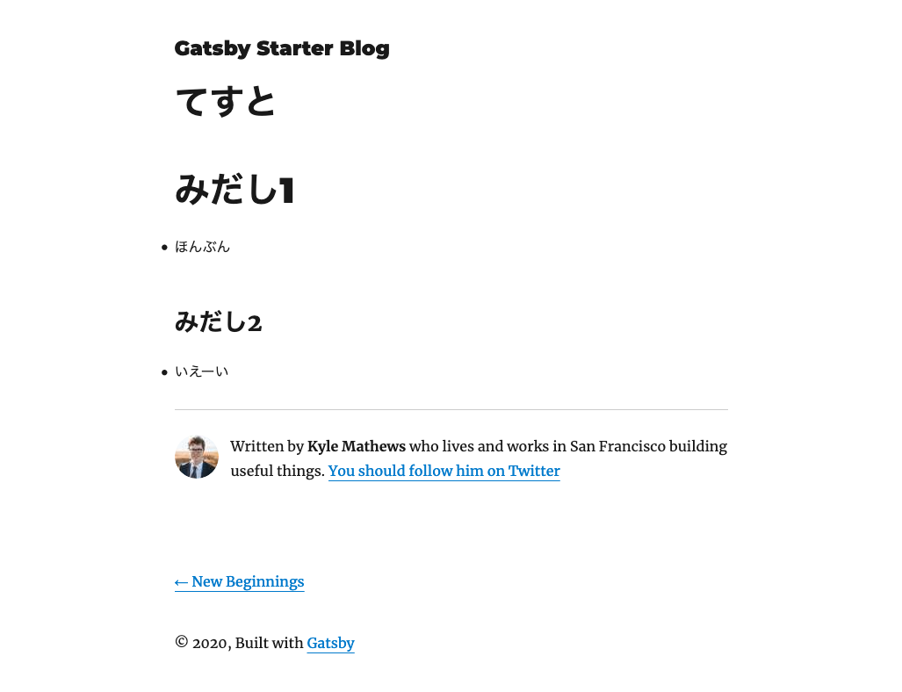

# はじめに

[GitHub Pages](https://pages.github.com/) ではブログ（静的サイトジェネレータ）のフレームワークとして **Jekyll** が紹介されていますが，環境整えなきゃなーと思っていたところ

<blockquote class="twitter-tweet"><p lang="ja" dir="ltr">GatsByJSいいよ。いちいちページファイル置かなくてもソースと雛形コンポーネントをAPIに渡すだけでページが生えてくる（勧誘</p>&mdash; func(mstdn.jp/@func_hs) (@func_hs) <a href="https://twitter.com/func_hs/status/1251819057935904800?ref_src=twsrc%5Etfw">April 19, 2020</a></blockquote> <script async src="https://platform.twitter.com/widgets.js" charset="utf-8"></script> 

と [GatsbyJS](https://www.gatsbyjs.org/) をおすすめいただきました。  
ので，**JavaScript および各種フレームワークが全くわからないマン** のわたしですが，挑戦してみることにしました。

ちなみに，わたしがどれぐらいわかってないかというと

1. プレーンな JavaScript すらほとんど書いたことがない

2. [reveal.js – The HTML Presentation Framework](https://revealjs.com/#/) を過去に使ってみたが，構造を理解する前に諦めた

3. 辛うじて JSON は使える

というレベルです。

こんな奴でも，とりあえずブログ（っぽいもの）をトータル 2h ちょいで作成できたので，ご参考になれば。

---

## Step-by-Step Guide っぽいもの

### 00. GatsbyJS を使う準備

[Preparing Your Environment | GatsbyJS](https://www.gatsbyjs.org/docs/preparing-your-environment/) に従いましょう。  
わたしはたまたま別用で Node.js の環境を nodebrew で整えていたので，下記の cmd を打つだけで ready になりました。

```
$ npm install -g gatsby-cli
```

### 01. ブログの雛形を作ってみる

なにやらスターターパッケージがあるらしいですね。  
全くわからないマンなのでありがたい限りです。早速 ~~パクって~~ いただいてきましょう。

```
$ gatsby new blog https://github.com/gatsbyjs/gatsby-starter-blog
$ cd blog && gatsby develop
```

なにやらコンソールでビルドがされたような感じのログが見えると思います。  
このままブラウザから `localhost:8000` にアクセスしてみましょう。

すると，ブログっぽいページが表示されたと思います。

### 02. ブログの記事を追加してみる

サンプルの構造を見るに  
`${GATSBY_ROOT}/content/blog/` 以下にディレクトリをほって `index.md` を追加するといい感じになりそうです。

ちなみに `gatsby new` してすぐ `gatsby develop` したときの `content/blog` 以下はこうなっている，はずです。

```
.
├── hello-world
│   ├── index.md
│   └── salty_egg.jpg
├── my-second-post
│   └── index.md
└── new-beginnings
    └── index.md
```

ここに適当に足してみましょう。

```
$ mkdir hoge && cd hoge
$ cat << EOF > index.md
> ---
> title: てすと
> ---
>
> # みだし
>
> * ほんぶん
>
> ## みだし2
>
> * いえーい
>
> EOF
---
title: てすと
---

# みだし

* ほんぶん

## みだし2

* いえーい
```

すると，**てすと** という記事が追加されたと思います。




### 03. とりあえず GitHub Pages で見られるようにしてみる

ここまでできたら，とりあえず GitHub Pages に載せちゃいましょう。  
細かいカスタマイズはあとですればよいのです。

まずは必要なもの一式を `${username}.github.io` リポジトリに push しておきます。  
`${username}.github.io` リポジトリの場合は，`origin/master` ブランチ内のコンテンツが公開ページになるので，GatsbyJS のフレームワーク一式などは，別のブランチに push することにします。  
ブランチ名はなんでもよいですが，ここでは `origin/develop` としておきましょう。

以下はわたしの環境での参考例です。

```
$ git remote add origin git@github.com:m-b-t-n/m-b-t-n.github.io
$ git remote get-url origin
git@github.com:m-b-t-n/m-b-t-n.github.io

$ git push -u origin develop
Enumerating objects: 43, done.
Counting objects: 100% (43/43), done.
Delta compression using up to 12 threads
Compressing objects: 100% (36/36), done.
Writing objects: 100% (43/43), 934.79 KiB | 4.92 MiB/s, done.
Total 43 (delta 4), reused 0 (delta 0), pack-reused 0
remote: Resolving deltas: 100% (4/4), done.
remote:
remote: Create a pull request for 'develop' on GitHub by visiting:
remote:      https://github.com/m-b-t-n/m-b-t-n.github.io/pull/new/develop
remote:
To github.com:m-b-t-n/m-b-t-n.github.io
 * [new branch]      develop -> develop
Branch 'develop' set up to track remote branch 'develop' from 'origin'.
```

つぎに，公開ページとなる部分をビルドして `origin/master` ブランチに反映（デプロイ）します。  
`packages.json` にデプロイするためのコマンドを追加してみましょう。

公式ページの  
[how-gatsby-works-with-github-pages :: installing-the-gh-pages-package](https://www.gatsbyjs.org/docs/how-gatsby-works-with-github-pages/#installing-the-gh-pages-package)  
あたりを参考にすればいけるはずですが，cmd だけかいつまんで置いておきます。

`gh-pages` をもらってきます。

```
$ npm install gh-pages --save-dev
```

下記 diff の通り `deploy` を仕込みます。

```
diff --git a/package.json b/package.json
index 88e8826..a1b2190 100644
--- a/package.json
+++ b/package.json
@@ -56,6 +56,7 @@
     "start": "npm run develop",
     "serve": "gatsby serve",
     "clean": "gatsby clean",
-    "test": "echo \"Write tests! -> https://gatsby.dev/unit-testing\" && exit 1"
+    "test": "echo \"Write tests! -> https://gatsby.dev/unit-testing\" && exit 1",
+    "deploy": "gatsby build && gh-pages -d public -b master"
   }
 }
```

ここまできたら `$ npm run deploy` してみましょう。  
多少時差はあるようですが，`https://${username}.github.io` を覗いて反映されていれば成功です！

適当な粒度で `origin/develop` への push もお忘れなく。

# まとめ

* GatsbyJS を使うことで静的サイト（ブログ）の雛形を作成することができた

* GitHub Pages を併用することで，GatsbyJS で構築したブログを比較的容易に公開できた

---

# 参考にしたリンク

* [GatsbyJSを試してみた - Qiita](https://qiita.com/Slowhand0309/items/a37865e9806cd143a6d7)

* [基礎から始めるGatsbyJS入門 | アールエフェクト](https://reffect.co.jp/react/gatsby-basic-tutorial-for-beginners#Gatsby)

* [How to Deploy a GatsbyJS Blog on GitHub Pages as a User Site - DEV Community 👩‍💻👨‍💻](https://dev.to/nielsenjared/how-to-deploy-a-gatsbyjs-blog-on-github-pages-as-a-user-site-26cb)

* [GatsbyJS + Github Pages でブログを作った | team-seadrive.com](https://team-seadrive.com/2019/09/blog_making/)

* [Gatsby + GitHub Pages でブログを構築 | suzukalight.com](https://github.com/suzukalight/suzukalight.github.io)

* [Gatsby のサイトを GitHub Actions で GitHub Pages にデプロイ - Qiita](https://qiita.com/peaceiris/items/2f6d83802f2aefa66f9d)

* [GitHub Actions による GitHub Pages への自動デプロイ - Qiita](https://qiita.com/peaceiris/items/d401f2e5724fdcb0759d)

* [peaceiris/actions-gh-pages: GitHub Actions for GitHub Pages 🚀 Deploy static files and publish your site easily. Static-Site-Generators-friendly.](https://github.com/peaceiris/actions-gh-pages#%EF%B8%8F-first-deployment-with-github_token)

