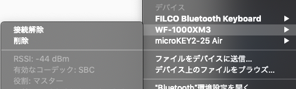

# はじめに

YouTube の広告がうざったいばっかりに YouTube Premium に加入したので，ついでに Google Play Music（どうやら YouTube Music に統合されるようですが）を使っていろいろ聴き漁っています。  
で，ケーブルが邪魔なので [WF-1000XM3](https://www.sony.jp/headphone/products/WF-1000XM3/) を接続して使っているのですが，どうも音がよくないような気が。

どうやら，標準では AAC ではなく SBC で接続されているようでした。  
\# 正確な bitrate などは不明

ということで，WF-1000XM3 と mac ちゃんを AAC で接続するための手順を記しておきます。

# 手順

## 0. 現在の設定の確認

まずは WF-1000XM3 と A2DP（オーディオ機器）で接続して，有効なコーデックが SBC なのか AAC なのか確認します。  
ちなみに macOS mojave (10.14.6) では `Option(Alt)` キーを押しながら上部の BT アイコンをクリックしてあげると，BT に関する詳細な情報を確認することができます。

わたしの環境（設定前）では下記スクショの通りになっていました。



## 1. A2DP コーデック設定の変更

ここからが本題です。  
一度接続を解除し，WF-1000XM3 をケースにしまっておきます。  
その後，普段お使いのターミナルで下記を打ち込みます。  
\# 使っていなければ Spotlight または LaunchPad から "Terminal.app" を出してください

```
sudo defaults write bluetoothaudiod "Enable AAC codec" -bool true
```

これで WF-1000XM3 をケースから取り出し再接続すると...？

"手順 0." で示した通りに確認して，`コーデック: AAC` となっていれば OK です。  
なっていなければ，一度 WF-1000XM3 を再起動してから再度接続してみましょう。  
\# WF-1000XM3 の場合は，ケースに収納後，L/R のタッチセンサーを 20[sec] 長押しすることで再起動できます  

期待通り設定できていれば，下記スクショの通りになっているはずです。


# おわりに

「AirPods 買えば？」というツッコミはなしでお願いします。

# 参考リンク

* [Bluetoothオーディオのコーデックをカスタマイズ - 新・OS X ハッキング!(210) | マイナビニュース](https://news.mynavi.jp/article/osxhack-210/)

