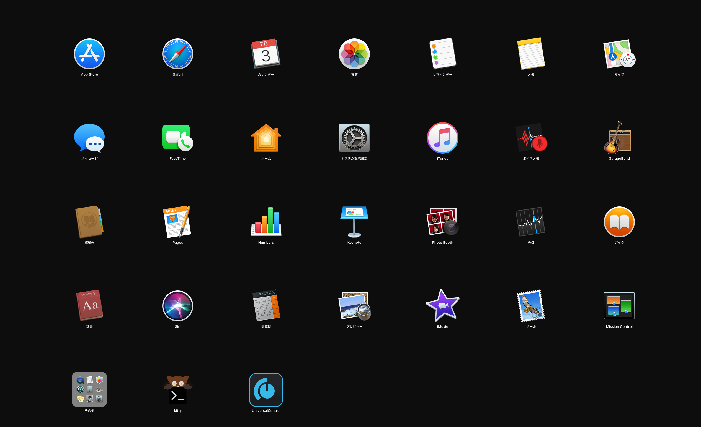
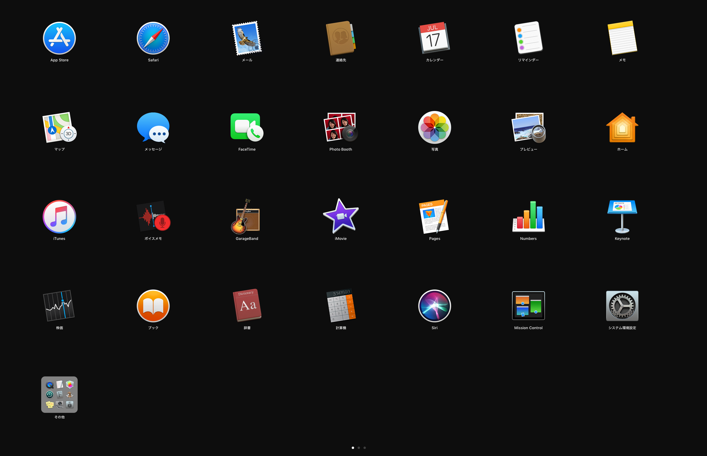

# はじめに

macOS を長く使っていると LaunchPad の並びがゴチャゴチャになってきますよね。  
それをすっきりさせるための小ネタです。

# TL; DR

わかってる人向け。「 `sudo` いるんだっけ？」と思って実験したら，いらなかった。

```
defaults write com.apple.dock ResetLaunchPad -bool true; killall Dock
```

# 手順

お使いのターミナルで上記 `defaults` から始まるコマンドを打ってください。  
\# 普段ターミナルを使わない方は Spotlight または LaunchPad から `ターミナル.app` または `Terminal.app` を起動してください

こんなかんじでぐちゃぐちゃだった LaunchPad が



きれいになります。



# おわりに

Automator と組み合わせるか，init スクリプトを起こして自動化しておくのもいいかもしれないと思ってます。  
わたしはそこまで頻繁にアプリを入れたり消したりはしないので，時々思い出したように手動で打ってます。

# 参考リンク

* [Launchpadを初期化する方法 (アイコンを整理する) | オーケーマック](http://okaymac.com/2015/10/05/launchpad-initialize/)

