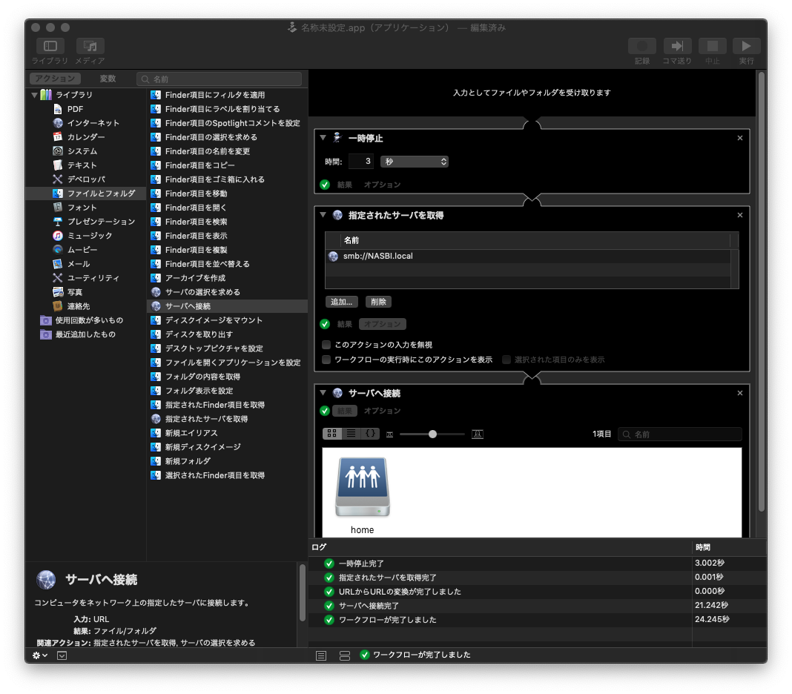
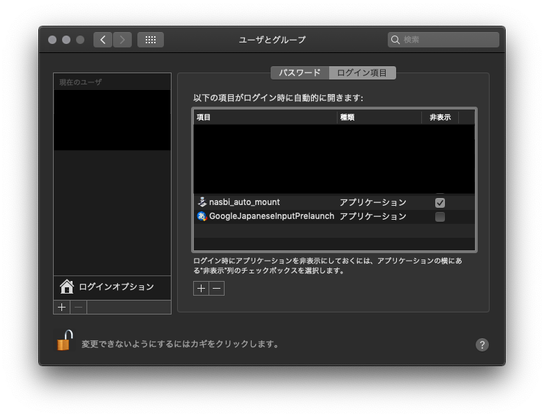

# はじめに

macOS において，OS 起動時に NAS を自動マウントする方法のメモです。  
Linux だと `/etc/fstab` に書いておいて hogehoge というのがよくあるやり方ですが，今回は macOS 付属の自動化ツールこと [Automator](https://support.apple.com/ja-jp/guide/automator/welcome/mac) を使ってみたいと思います。

# 環境

* macOS mojave (10.14.x)

* SMBv2 以上で稼働しているネットワークドライブ(NAS)

# 方法

## 1. Automator を起動する

「新規作成」 -> 「アプリケーション」 を選択する。

## 2. 画像の通りにフローを作成する

できたと思ったら右上の「実行」を押して期待通りマウントされるか確認する。  
失敗する場合は下記箇所を確認して対処する。

* `<NAS_name>.local` を使う場合は `bonjour サービス` が有効になっているか確認する

* IP アドレス直打ちの場合は指定されたアドレスが正しいか確認する

* マウントポイントが存在しているか？ ※自分で予め `/Volumes/` 以下にマウントポイントを掘っておく必要があったかもしれない

## 3. **適当な名前.app** として保存しておく

保存場所はどこでもよいが，iCloud などのクラウドストレージに置いておくと PC 再セットアップ時に便利かも。

## 4. ログイン時に自動マウントする設定を追加する

システム設定より「ユーザとグループ」 -> 「＜自分＞」 -> 「ログイン項目」を選択する。  
先程作成した **適当な名前.app** をログイン時に自動実行する項目として追加する。

# おわりに

必要に応じて `ln -s /Volumes/home/Documents /home/nas_docs` のようにシンボリックリンクを貼っておくと便利かもしれません。  
それでは，よい macOS ライフを。

